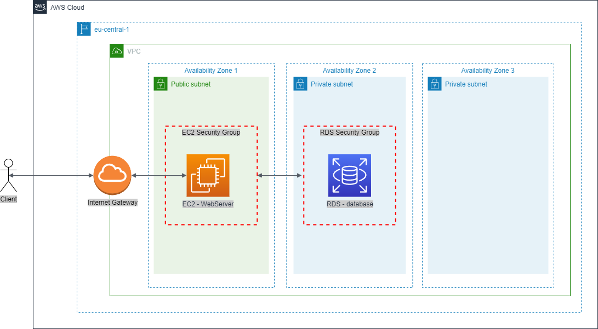

# SimpleInfrastructure
This repository contains simple infrastructure as a code to deploy using terraform. It contains:
1. EC2 Instance, for a WebServer containing frontend and backend application,
2. RDS database, used by our application
3. New VPC for our infrastructure

The infrastructure should look like below:

